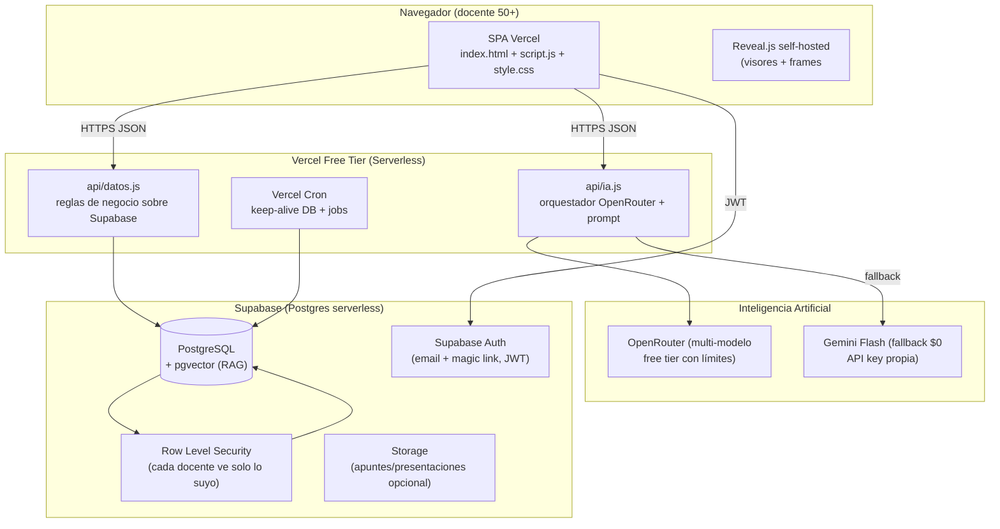
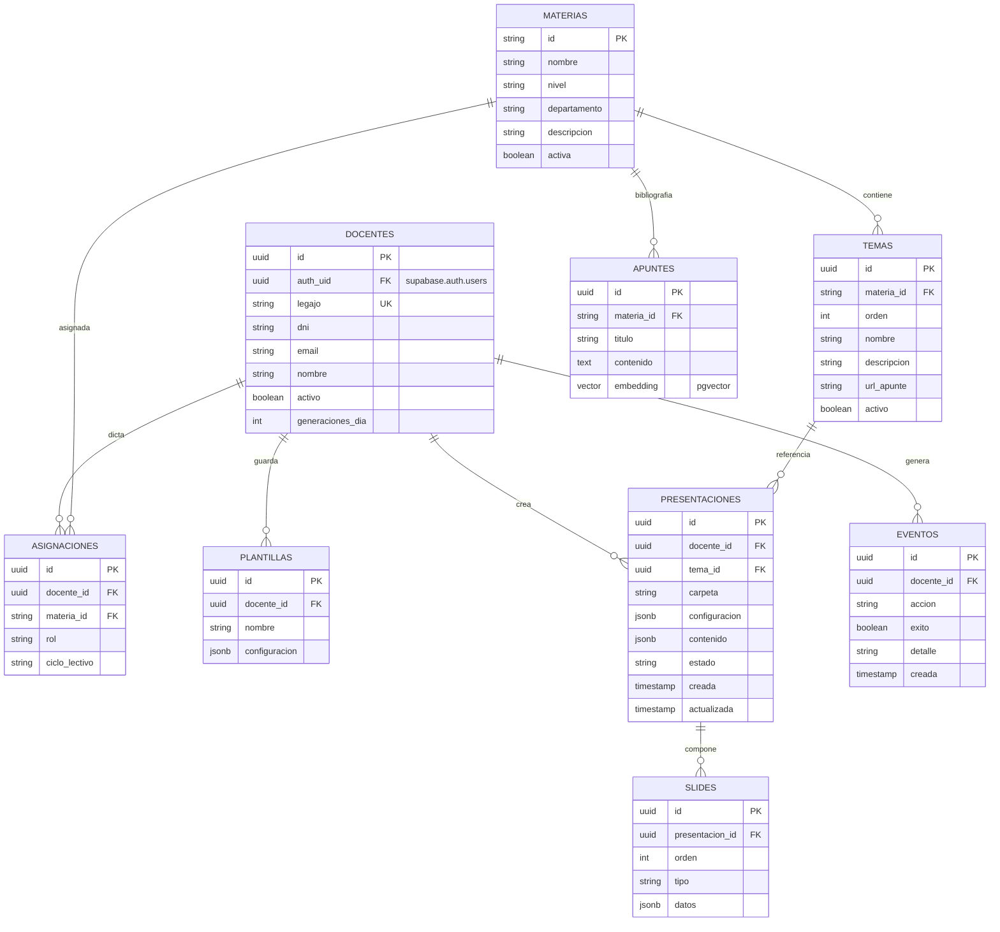
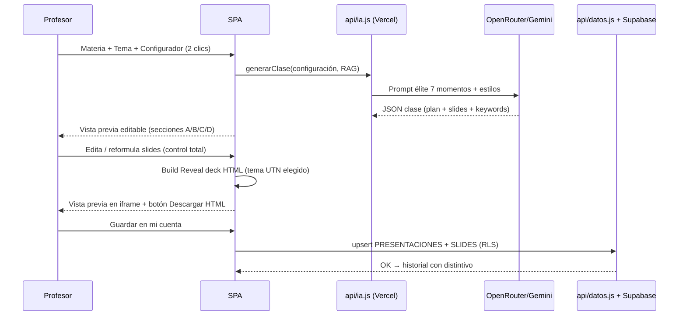

# PLAN BETA FINAL — UTNContenidos 0.1.0 (Alpha → Beta)

> **Fase:** Transición Alpha 0.5 → Beta 0.1.0 — stack productivo definitivo.
> **Regla de hierro:** costo total **$0** · público docentes 50+ UTN FRD · español argentino (vos).
> **Metodología:** modelo espiral por sprints B1→B6, cada uno con DoD y QA antes de avanzar.

---

## 1. Visión y metas de la Beta

**Meta de producto:** que un profesor de 65 años genere, edite y comparta una clase completa (presentación HTML con identidad UTN) en ≤6 clics, sin tocar PowerPoint ni Google Slides.

**KPIs de éxito (medibles al cerrar cada sprint):**

| KPI | Meta |
|-----|------|
| Login → dashboard | < 2 s |
| Generación de clase (IA) | < 15 s |
| Presentación generada | HTML autocontenido, descargable, con notas de orador |
| Seguridad | Checklist `utn-security-audit` 100% verde |
| Costo | $0 verificable |
| QA | Flujo completo testado por docente real antes de cada entrega |

---

## 2. STACK FINAL (decisiones firmes)

| Capa | Tecnología | Por qué | Costo |
|------|-----------|---------|-------|
| **Frontend SPA** | Vanilla JS + sistema de diseño propio (ya probado) servido en **Vercel Free** | Cero dependencias, load instantáneo, dominamos el código | $0 |
| **API** | **Vercel Serverless Functions** (`api/*.js` en Node) | Sustituye GAS: sin cold start de 6s, sin límites de ejecución, escala con tráfico | $0 |
| **Base de Datos** | **Supabase (Postgres + RLS + pgvector)** | DB REAL serverless: relaciones, transacciones, generación de embeddings para RAG, seguridad por fila (RLS). Free tier: 500MB + 50k usuarios/mes. *Revisar límites vigentes al implementar* | $0 |
| **Autenticación** | **Supabase Auth** (email + código mágico) → futuro Microsoft Entra ID | Auth profesional con JWT + RLS. Legajo/DNI quedan como dato administrativo sincronizado, no como credencial | $0 |
| **IA** | **OpenRouter** como gateway multi-modelo (free tier) **con fallback directo a Gemini** (key existente) | Mejor modelo disponible, promos internas, y si OpenRouter falla, sigue igual de funcional | $0 |
| **Presentaciones** | **Reveal.js 5** (MIT, self-hosted en el repo) | HTML puro: el usuario tiene control TOTAL (edita cualquier slide), temas propios UTN, notas de orador, export PDF. Salir del mundo "regulado" de PPT/Slides | $0 |
| **Export opcional** | PPTXGenJS (MIT, cliente) | Quien quiera un `.pptx` lo descarga con 1 clic (fase opcional B4) | $0 |
| **Repo/CI** | GitHub + Vercel auto-deploy (ya operativo) | — | $0 |
| **Telemetría** | Tabla `eventos` en Postgres (sustituye `Log_Eventos` de Sheets) | Auditabilidad real | $0 |

**Descarte razonado:**
- ❌ Google Apps Script: inmantenible, cold-start inmenso, sin versionado, límites de 6 min. Se reemplaza por Vercel Functions.
- ❌ Google Sheets como DB: es una planilla, no una base de datos; sin transacciones reales ni seguridad por usuario.
- ❌ Presentaciones en Google Slides/PowerPoint: salida "regulada", sin control visual; se reemplaza por HTML + Reveal.js.
- ❌ skills.md marketplace: skills de pago; violan la regla $0. Se usan como *referencia* de catálogo, no se contratan.

---

## 3. ARQUITECTURA FINAL (Mermaid)



---

## 4. MODELO DE DATOS FINAL (Mermaid ER)



**Seguridad por diseño:** `RLS` en todas las tablas → política `docente_id = auth.uid()`; un profesor jamás puede leer la presentación de otro.

---

## 5. FLUJO DE PRESENTACIONES HTML (Mermaid)



**Salidas de la presentación:** archivo `.html` autocontenido (Reveal + CSS inline) descargable · PDF (via print/`html2pdf`) · opcional `.pptx`.

---

## 6. MOTOR DE GENERACIÓN — algoritmo y pseudocódigo

**Objetivos:** (1) respuesta determinista al contrato, (2) N slides exactas, (3) estilo visual aplicado, (4) máximo ahorro de tokens.

**Pseudocódigo (backbone de la Beta, implementar en api/ia.js):**

```
function generarClase(materia, tema, config, contextoRAG):
  # 1. Sanitizar entradas (caps: materia 200, tema 300, config instrucciones 2000)
  # 2. Armar prompt con bloques estrictos: sistema + configuracion + apunte
  # 3. Llamar modelo principal (OpenRouter):
  #      - schema JSON estricto (busqueda, plan, slides[N], promptsImagenes)
  #      - temperature 0.2, responseMimeType application/json
  # 4. Si falla o timeout -> fallback Gemini (misma llamada)
  # 5. Validar y corregir:
  #      - slides.length != N  ->  retry correctivo (1 sola vez)
  #      - validar tipos obligatorios (titulo, contenido, notasOrador)
  # 6. Devolver { success, clase, modeloUsado, configuracionAplicada }

function buildRevealDeck(clase, estilo):
  # 1. Elegir tema CSS UTN según estilo (clasica/minimalista/contemporanea/alta_carga)
  # 2. Slide 1: portada (banda, titulo, institucional)
  # 3. Por slide: section data-background + chip categoria + bullets marcados
  #    + widget destacado + imagen (lazy, con fallback icono) + notas <aside class="notes">
  # 4. Embeber CSS (inline) -> HTML autocontenido listo para descargar
```

**Metodología de razonamiento por sprint (orden innegociable):**
1. Objetivos y metas del sprint → 2. Algoritmo → 3. Pseudocódigo (interno) → 4. Código → 5. QA + auditoría → 6. Push + memoria + cronológico.

---

## 7. ROADMAP ESPIRAL — SPRINTS BETA

| Sprint | Objetivo | Entregable | DoD |
|--------|----------|-----------|-----|
| **B1** | Base de datos real | Supabase provisionado · migración de datos desde Sheets (script idempotente) · cron keep-alive · tablas + RLS | Login/registro contra Postgres OK · `node --check` · checklist seguridad verde |
| **B2** | Chau AppScript | Todas las acciones migradas a `api/*.js` en Vercel (login, temas, plantillas, historial, agregar tema) · GAS desactivado | Frontend usa solo Vercel · prueba E2E real del docente |
| **B3** | Presentaciones HTML | Engine Reveal build + temas UTN por estilo + vista previa iframe + descarga HTML + PDF + notas de orador | El profesor descarga su presentación autocontenida y la abre en cualquier navegador |
| **B4** | IA v2 | OpenRouter multi-modelo + fallback Gemini + RAG con pgvector (embeddings de apuntes) + streaming de generación | Generación <15s · configuraciones se notan SIEMPRE · costo $0 |
| **B5** | Blindaje + QA masivo | Auditoría `utn-security-audit` sobre el nuevo stack · rate-limit · load test ligero · QA con docente real 50+ · review legal interno | Cero críticos · flujo ≤6 clics aprobado por humano |
| **B6** | Corte y entrega | Apagar GAS/Sheets (solo histórico) · `diagramas.html` Beta · docs de producción · entrega institucional pasantía | Alfa desactivada · Beta 0.1.0 operativa con URLs nuevas |

---

## 8. EQUIPO DE AGENTES PROFESIONALES (orquestación)

Cada rol es un subagente con skill propia en `.opencode/skills/` (gratis, local). Estándar de calidad: código como si lo escribiera un senior ex-Google/Apple/Nike.

| Rol | Skill | Responsabilidad |
|-----|-------|-----------------|
| Arquitecto / Scrum | (orquestador) | Visión global, decisiones de stack, costo $0, orden espiral |
| **DB Senior** | `utn-db-supabase` (crear en B1) | Esquema final, migración RLS, índices, pgvector |
| **Frontend Senior** | `utn-frontend-ux50` (existe) | SPA, accesibilidad 50+, WCAG 2.1 AA |
| **Motion/UI iOS** | `utn-visual-system` (crear en B3) | Temas UTN, microinteracciones, Reveal design |
| **IA/Prompt Senior** | `utn-class-builder` (existe) + `utn-ia-openrouter` (crear en B4) | Prompt élite, orquestación multi-modelo, token economy |
| **Ciberseguridad** | `utn-security-audit` (existe) | RLS, JWT, rate-limit, CSP, secrets |
| **QA Senior** | `utn-qa-beta` (crear en B5) | Casos límite, flujo docente real, pruebas E2E |
| **Legal / Institucional** | `utn-legal-institucional` (crear en B5) | PDP, términos, uso pasantía, licencias |
| **Docs / Memoria** | `utn-memory` (existe) | memory.md + cronológico + planes |

---

## 9. AUDITORÍA DEL MODELO ACTUAL + MEJORAS DE IA

**Lo que queda bien (se conserva):** prompt élite de 7 momentos · schema JSON estricto · anti prompt-injection · parse tolerante · enforcement de N slides.

**Mejoras Beta:**
1. **OpenRouter** como gateway: probar modelos free por tema (ej: generación de clase vs reformulación por slide). `modeloUsado` en el log.
2. **RAG real con pgvector**: embeddings de apuntes en Supabase → recuperación semántica (en vez de cortar a 15k chars ciegamente). Si pgvector excede free tier, fallback: chunking por secciones + truncado 15k (hoy).
3. **Streaming (SSE)**: la generación llega progresivamente (UX de "va armando la clase"), sin esperar 15s en negro.
4. **Mejora de estilos**: cada estilo del configurador define idioma visual del prompt (no solo el CSS): densidad de bullets, tono, iconografía.
5. **Caché de respuestas**: misma materia+tema+config → servir cache 24h (ahorra cuota).

---

## 10. INSTITUCIONALIDAD, PÚBLICO Y LEGAL

- **Contexto:** proyecto creado dentro de horas de pasantía en UTN FRD, con vocación institucional. Formalidad en docs y entregas; identidad UTN intacta.
- **Público:** docentes 50+. Letra grande, contraste AA, feedback visual, "vos", ≤6 clics.
- **Datos personales (Ley 25.326, Argentina):** legajo, DNI, email.
  - Los datos viven en la cuenta institucional (Supabase org UTN).
  - Sólo se envía a la IA el contenido académico estrictamente necesario (apunte + consigna); nunca datos de alumnos.
  - Derecho de supresión: borrar presentación/historial debe ser posible (incluir "Eliminar" en historial en B2).
  - Revisar términos de uso de OpenRouter para datos (si no son aptos, queda Gemini).
- **Licencias:** Reveal.js MIT · PPTXGenJS MIT · código propio. Sin dependencias de pago.
- **Comunicación:** lenguaje institucional simple; el "vos" argentino coherente con la audiencia.

---

## 11. BLINDAJE BETA (checklist final)

- [ ] RLS activo en TODAS las tablas (docente ve solo lo suyo)
- [ ] JWT verificados en las serverless functions
- [ ] Rate-limit login y de generación (limite diario en tabla `docentes`)
- [ ] Secrets solo en env vars de Vercel (SUPABASE_SERVICE_KEY, OPENROUTER_API_KEY, GEMINI_API_KEY)
- [ ] CSP actualizado al stack nuevo
- [ ] Anti prompt-injection en el RAG (conservado)
- [ ] No exponer PII en logs ni telemetría
- [ ] Backup de datos previo a la migración B1
- [ ] DO manual de "cómo desplegar de nuevo" actualizado (CHECKLIST_DEPLOY.md v2)
- [ ] Costo $0 verificado post-migración

---

## 12. MIGRACIÓN Y CUTOVER (sin downtime)

1. **B1:** exportar Sheets → CSV → script de importación idempotente a Supabase.
2. **B2:** app corre en paralelo leyendo Supabase; GAS queda como lector de solo-lectura hasta el corte.
3. **B6:** apagar GAS. Sheets queda como respaldo histórico (no se borra).
4. URLs nuevas documentadas; `GAS_API_URL` deshabilitada del frontend.

---

## 13. RIESGOS Y MITIGACIONES

| Riesgo | Mitigación |
|--------|-----------|
| Free tier de Supabase se pausa por inactividad | Vercel Cron keep-alive cada 5 min |
| Free tier de OpenRouter insuficiente | Fallback Gemini (ya probado) |
| Docente sin cuenta de email institucional | Auth Supabase acepta cualquier email + verificación por código; Entra ID en fase 2 |
| Reveal.js cambia API en v5 | Self-host: pinneamos la versión en el repo |
| Costo se desvía de $0 | Review de costos al cierre de cada sprint |

---

## 14. DECISIONES ABIERTAS (cuestionario para Juanma)

1. **Supabase org:** ¿creás el proyecto gratis en supabase.com con tu cuenta (y me pasás URL + anon key + service key), o querés que te arme el paso a paso?
2. **Login Beta:** ¿email + código mágico (recomendado para 50+), o email + contraseña?
3. **OpenRouter:** ¿tenés/querés crear cuenta y key (free), o arrancamos solo con Gemini y OpenRouter queda como mejora B4 opcional?
4. **Export .pptx:** ¿lo priorizamos en B4 o queda para después de la beta?

---

## 15. PRIMER PASO CONCRETO (B1)

El sprint B1 arranca al confirmar el cuestionario: provisionar Supabase → esquema (sección 4) → migración → cron. Sin bloqueos: ejecuto, pusheo y audito como está definido en la metodología.