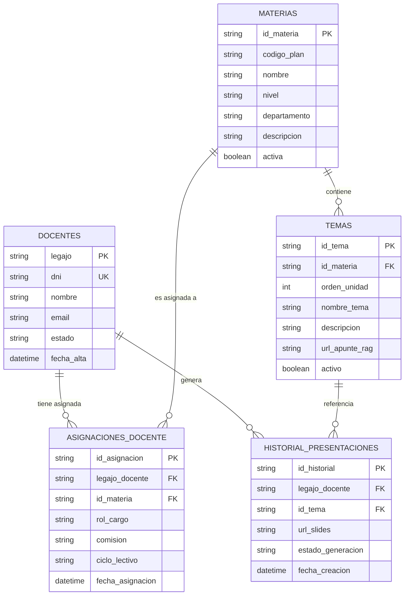

# Memory — UTNContenidos Engineering

> **Última actualización:** 2026-09-08  
> Este archivo es la fuente de verdad técnica del proyecto. Solo se agregan entradas, nunca se sobreescriben las anteriores.

---

## 🔴 Correcciones Confirmadas por el Usuario

| Fecha | Corrección |
|-------|------------|
| 2026-08-07 | **`gemini-3.1-flash-lite` ES un modelo válido** de la Gemini API para API Key. El análisis inicial lo marcó como incorrecto — estaba equivocado. El modelo está bien configurado en `api/gemini.js`. |
| 2026-08-07 | **El login tarda 12 segundos reales** en producción. Confirmado por el usuario. Causa raíz auditada en `app.js`. |

## 📝 Feedback del Usuario — 2026-09-15 (pendientes α0.6)

| # | Problema reportado | Solución |
|---|-------------------|----------|
| 1 | El profesor **no puede agregar temas** en "Temas del programa" por materia | Nueva acción GAS `agregarTema` + botón "＋ Agregar tema" en el dashboard + modal |
| 2 | Historial pobre: sin distintivo de uso, sin carpetas, sin reabrir contenido, sin auto-limpieza | Badge de estado (usado/no usado), carpetas, botón "Reabrir clase" (guarda `datosClase` JSON), auto-archivado >15 días (estado "ARCHIVADO") |
| 3 | Confusión: ¿la IA la llama `app.md` o `api/gemini.js`? Y personalizar no cambia la salida | Aclarar arquitectura híbrida + reforzar impacto de la config (enforce numSlides + bloque de estilo) |
| 4 | Las plantillas NO están en ninguna BD (solo localStorage) | Nueva hoja `Plantillas` (3NF) + acciones GAS `guardarPlantilla`/`obtenerPlantillas`/`borrarPlantilla` |
| 5 | Diagramas desactualizados | Actualizar `diagramas.html` (ER con Plantillas + Historial enriquecido) y `memory.md` ER |
| 6 | Pantalla de personalización "fea" | Rediseño minimalista iOS 27 + sin scrollbar en el modal configurador |
| 7 | **Las Google Slides se ven "sin personalidad"** (como HTML sin CSS): fondo plano, títulos sueltos, sin jerarquía visual, sin branding institucional | **PRIORIDAD MÁXIMA — Rediseño del motor visual de Slides**: tema institucional completo (paleta, bandas de color, chips de categoría, bullets con marcadores, pie de página, números), respetando el `estilo` elegido en el configurador (clásica/minimalista/contemporánea/alta-carga). El frontend debe pasar `configuracion` al exportar |

---

## 🏛️ Decisiones de Arquitectura Permanentes

### GAS es irremplazable a costo $0 para Google Workspace
**Decisión:** Google Apps Script se mantiene como backend para:
- `exportarAGoogleSlides()` — `SlidesApp.create()` no tiene equivalente gratuito
- `obtenerContextoTema()` — `DocumentApp.openById()` para leer apuntes en Docs
- `obtenerHistorialDocente()` — historial en Sheets

**Razón:** Ningún servicio a costo $0 tiene acceso nativo a Google Slides/Docs/Drive como GAS. Firebase y Supabase no pueden replicar esto.

**Lo que SÍ se puede migrar de GAS:** Autenticación (`validarDocente`) y base de datos de usuarios/materias (Google Sheets → Supabase PostgreSQL).

### Costo total del proyecto: $0 absoluto
**Restricción innegociable.** Toda propuesta debe respetar:
- ✅ Google Apps Script (gratuito)
- ✅ Google Workspace (Drive, Sheets, Docs, Slides — cuenta institucional UTN)
- ✅ Vercel Free Tier (frontend + serverless functions)
- ✅ Gemini API — Free Tier / gemini-3.1-flash-lite (API Key de Google AI Studio)
- ✅ Supabase Free Tier (500MB DB, 50k req/mes) — para migración futura
- ❌ AWS, GCP de pago, Firebase de pago, cualquier servicio con suscripción

### Público objetivo: docentes de 50+ años, UTN FRD
**Restricción de UX innegociable:**
- Letra grande, alto contraste, botones evidentes
- Máximo 2 clics para llegar a "Preparar Clase"
- Feedback visual inmediato en cada acción (loaders, toasts, animaciones)
- Lenguaje simple, en español argentino (vos)
- La plataforma debe ser autosuficiente — sin necesidad de manual

---

## 🐛 Diagnóstico Técnico Confirmado

### Login de 12 segundos — Causa raíz en `app.js`

**Tres culpables en `validarDocente()` (app.js líneas 39–80):**

1. **Cold Start de GAS (~3–6s):**  
   GAS duerme si no recibe requests. El primer login del día activa el cold start.  
   _Solución:_ Trigger de warmup cada 4 minutos (15 min de trabajo, costo $0).

2. **3× `getDataRange().getValues()` en secuencia (~3–6s total):**  
   ```
   sheetDocentes.getDataRange()  → ~1-2s (API call bloqueante a Sheets)
   sheetMaterias.getDataRange()  → ~1-2s
   sheetTemario.getDataRange()   → ~1-2s
   ```
   _Solución:_ `CacheService.getScriptCache()` para cachear el dashboard completo por legajo (TTL: 1 hora).

3. **Join O(n²) en `obtenerMateriasYTemas()` (app.js líneas 101–142):**  
   Loop de Materias × loop de Temario en memoria. Escala mal con 100+ docentes.  
   _Solución futura:_ Migrar a Supabase PostgreSQL con query JOIN indexado.

### Token de sesión — Estado actual CORRECTO
El token usa `Utilities.getUuid()` (UUID v4) guardado en `CacheService` con TTL de 2 horas. Esto **es correcto y seguro** para el contexto actual. No requiere HMAC — el UUID v4 tiene 122 bits de entropía, inforgeable en la práctica.

### RAG sin caché — Confirmado como problema
`obtenerContextoTema()` re-lee el Google Doc completo en cada generación. Con `CacheService` (TTL 6h), el segundo request al mismo Doc baja de 3–5s a ~100ms.

---

## 📁 Mapa de Archivos del Proyecto

| Archivo | Rol | Notas |
|---------|-----|-------|
| `index.html` | SPA — Estructura HTML completa | 4 vistas: login, dashboard, generator, historial |
| `script.js` | SPA Router + lógica frontend | 743 líneas. Fetch a GAS y a Vercel. |
| `style.css` | Estética premium | Glassmorphism, ambient orbs, Inter/Outfit fonts |
| `api/gemini.js` | Vercel Serverless — Proxy Gemini | 132 líneas. Protege la API key. Modelo: gemini-3.1-flash-lite ✅ |
| `app.js` | GAS Backend — 441 líneas | Auth, RAG, Slides, Historial. Desplegado como Web App. |
| `vercel.json` | Config deploy Vercel | ✅ Corregido: `max-age=3600, must-revalidate` (no más immutable) |
| `UTNContenidos.md` | System Instructions del Escuadrón | Define roles, principios, flujo funcional |
| `PLAN_ALPHA_5.md` | Plan de auditoría y roadmap Alpha 0.5 | 4 sprints: Blindaje → Configurador → Fiabilidad → Distribución |
| `DocumentoCronologico.md` | Bitácora institucional (pasantía) | Cronología del sistema, tono formal/explicativo. Se actualiza con cada cambio |
| `diagramas.html` | Diagramas de arquitectura (Mermaid 11) | Actualizado al Sprint A: blindaje + ER + flujo docente + roadmap |
| `AGENTS.md` | Índice rápido del proyecto | Reglas + mapa de archivos + workflow |
| `.opencode/skills/` | 6 skills del proyecto | gas-backend · security-audit · frontend-ux50 · class-builder · token-economy · memory |
| `PLAN_ALPHA_5_SPRINT_B.md` | Plan Sprint B (modelo espiral) | Configurador de Clase: contrato + 4 giros |
| `WALKTHROUGH_FASE2.md` | Migración Microsoft Entra ID | Auth M365 → Graph → PPTXGenJS, manteniendo Google |
| `memory.md` | Este archivo | Fuente de verdad técnica. Solo append. |

### Esquema Relacional Normalizado (DLR / 3NF - Fase 2)



| Hoja / Tabla | Columnas |
|---|---|
| `Docentes` | A: Legajo · B: DNI · C: Nombre · D: Email · E: Estado · F: Fecha_Alta |
| `Materias` | A: ID_Materia · B: Codigo_Plan · C: Nombre · D: Nivel · E: Departamento · F: Descripcion · G: Activa |
| `Asignaciones_Docente` | A: ID_Asignacion · B: Legajo_Docente · C: ID_Materia · D: Rol_Cargo · E: Comision · F: Ciclo_Lectivo · G: Fecha_Asignacion |
| `Temas` | A: ID_Tema · B: ID_Materia · C: Orden_Unidad · D: Nombre_Tema · E: Descripcion · F: Link_Teoria · G: Activo |
| `Historial_Presentaciones` | A: ID_Historial · B: Legajo_Docente · C: ID_Tema · D: URL_Slides · E: Estado_Generacion · F: Fecha_Creacion |

---

## 📊 Estado Consolidado (panorama rápido)

**Versión en producción:** α0.5.6 · `https://utncontenidos.vercel.app` · repo `github.com/juanmamerodio/UTNContenidos` (main)

| Área | Estado |
|------|--------|
| Sprint A (Blindaje) | ✅ COMPLETO — rate-limit, CSP, LockService, payload caps, anti-injection, debugSheetData gated, Cache-Control |
| Sprint B (Configurador) | ✅ COMPLETO — 4 espirales: contrato → reformular → editar → plantillas |
| QA + Prueba del Hombre | ✅ APROBADO (16/16 tests + prof 65 años) |
| Deploy producción | ✅ En vivo y verificado |
| Sprint C (Fiabilidad UX) | 🔲 Pendiente |
| Sprint D (Distribución) | 🔲 Pendiente (clasp, audit log, checklist deploy) |
| Fase 2 (Auth Microsoft Entra) | 📋 Documentada en `WALKTHROUGH_FASE2.md` |

## 📋 Backlog Técnico Priorizado| Estado | ID | Tarea | Esfuerzo | Sprint |
|--------|----|-------|----------|--------|
| ✅ Completado | T1 | **Warmup Trigger GAS** (función `mantenerCaliente` agregada en `app.js`) | 15 min | S1 |
| ✅ Completado | T2 | **CORS restrictivo** en `api/gemini.js` (dominios autorizados Vercel/Local) | 10 min | S1 |
| ✅ Completado | T3 | **Fix Cache-Control** en `vercel.json` (`max-age=3600, must-revalidate`) | 5 min | S1 |
| ✅ Completado | T4 | **CacheService dashboard** en `validarDocente()` (evita re-lectura bloqueante de Sheets) | 2h | S2 |
| ✅ Completado | T5 | **CacheService RAG** en `obtenerContextoTema()` (lectura instantánea a ~100ms de Google Docs) | 1h | S2 |
| ✅ Completado | T10 | **Reclamar/Gestionar Materias** (Backend `obtenerOfertaAcademica` + `reclamarMaterias`, Modal UI y sincronización de Dashboard) | 2h | S2 |
| ✅ Completado | T6 | **Rediseño de Presentaciones & Prompt de Élite IA v3.0** (7 slides didácticos, notas de orador nativas en Google Slides/PDF y branding UTN) | 2h | S2 |
| ✅ Completado | T11 | **Rediseño Premium Verde UTN (#455656) & UI Multi-Dispositivo** (Mobile-first, stepper didáctico, tablets y accesibilidad 50+) | 3h | S3 |
| ✅ Completado | A-F1→A-F7 | **Sprint A — Blindaje** (rate-limit login, lockout 15min, throttle global, `debugSheetData` gated, payload caps, LockService, anti prompt-injection, parse JSON seguro, CSP, Cache-Control) | ~8h | A |
| ✅ Completado | D1/D2/D3 | **Fix integridad datos** (fecha historial, revalidación DLR, IDs relacionales en export) | ~3h | A |
| 🔲 Pendiente | T7 | **Versionar GAS con clasp** — `gas/app.gs` en el repo | 1h | S3 |
| 🔲 Pendiente | T8 | **Migrar Auth a Supabase** — login ~200ms permanente | 1 semana | S4 |
| 🔲 Pendiente | T9 | **Migrar DB (Sheets) a Supabase PostgreSQL** | 2 semanas | S4 |
| 🔲 Pendiente | B-F1→B-F5 | **Sprint B — Configurador de Clase** (duración, N° slides, estilo, nivel, ejemplos, imágenes, momentos, plantillas) | ~8h | B |
| ✅ Completado | B-E1 | **Sprint B Espiral 1 — Contrato + Configurador UI** (contrato `configuracion` end-to-end, modal configurador con slider/selects/momentos, plantillas localStorage, N slides dinámicas en GAS+Vercel) | ~4h | B |
| ✅ Completado | B-E2 | **Sprint B Espiral 2 — Regeneración quirúrgica de 1 slide** (modal `modal-reformular`, `renderizarSlidesGrid()` reutilizable con botón "Reformular" por card, `regenerarSlideConGeminiGAS` + case `regenerarSlideIA` en GAS, modo `regenerarSlide` con `slideSchema` en Vercel) | ~4h | B |
| ✅ Completado | B-E3 | **Sprint B Espiral 3 — Editor previo a exportar** (modal `modal-editar` con título/subtítulo/contenido/notas, botón "Editar contenido" en toda card, mutación directa de `claseGeneradaActual` → Slides/PDF exportan lo editado) | ~3h | B |
| ✅ Completado | B-E4 | **Sprint B Espiral 4 — Plantillas con nombre + Cierre** (`localStorage.utn_plantillas` objeto nombre→config, selector + guardar/cargar/borrar con try/catch, `refrescarSelectorPlantillas`) | ~3h | B |
| 🔲 Pendiente | C-F4→C-F8 | **Sprint C — Fiabilidad UX** (portada Slides robusta, imágenes con fallback, datos completos dashboard, loaders por etapa) | ~5h | C |
| ✅ Completado | C-F4/C-F6/C-F8 | **Sprint C — Fiabilidad UX (α0.5.7):** Portada robusta (shapes explícitos + autofit), imágenes con timeout 6s + fallback, temperatura unificada 0.2, loaders por etapa + foco accesible en dialogs | ~4h | C |
| ✅ Completado | α0.6-F1→F6 | **Sprint α0.6 — Feedback del Usuario (2026-09-15):** (1) `agregarTema` GAS + modal + botón en dashboard; (2) historial con distintivo (reciente/usado/archivado>15d), carpeta (`actualizarHistorial`), reabrir clase (`datosClase` JSON col I); (3) enforcement de numSlides con retry correctivo en GAS; (4) hoja `Plantillas` 3NF + `guardarPlantilla`/`obtenerPlantillas`/`borrarPlantilla` con sync localStorage+BD; (5) diagramas actualizados (ER con Plantillas + secuencia); (6) configurador rediseñado iOS 27 minimal (chips, pills, details, sin scrollbar) | ~8h | α0.6 |
| 🔲 Pendiente | D-F1→D-F4 | **Sprint D — Distribución** (clasp, checklist deploy, audit log Sheets, OAuth Microsoft Entra) | ~4h+ | D |
| ✅ Completado | D-F2/D-F3/D-F5 | **Sprint D — Telemetría & Límites (α0.7):** Audit log en `Log_Eventos` (LOGIN/GENERAR_CLASE/EXPORTAR_SLIDES/AGREGAR_TEMA/plantillas/historial), tope diario 20 gen/docente (CacheService TTL 24h), transferencia de propiedad del Slides al docente (DriveApp.setOwner) | ~3h | D |
| ✅ Completado | D-F4 | **Checklist de despliegue** (`CHECKLIST_DEPLOY.md` con pasos GAS/Vercel/Sheets/verificación) | 1h | D |
| 🔲 Pendiente | D-F1 | **Versionar GAS con clasp** (`gas/app.gs`) — requiere credenciales clasp | 1h | D |
| 🔲 Pendiente | α0.6-F1→F6 | **Sprint α0.6 — Feedback del usuario** (agregar temas, historial con carpetas/estado/reabrir, enforce config IA, plantillas en BD, diagramas, UI minimalista) | ~6h | α0.6 |

---

## 🧠 Log de Conversaciones

| Fecha | Evento |
|-------|--------|
| 2026-08-07 | Primera auditoría completa. Leídos: `index.html`, `script.js`, `style.css`, `api/gemini.js`, `app.js`, `vercel.json`, `UTNContenidos.md`, `plan23-06.md`. |
| 2026-08-07 | Usuario corrigió: `gemini-3.1-flash-lite` es válido. Incorporado. |
| 2026-08-07 | Usuario confirmó: login real tarda 12 segundos. Causa raíz identificada en 3 puntos de `app.js`. |
| 2026-08-07 | Decisión de arquitectura: GAS se mantiene para Google Workspace. Se optimiza con CacheService + warmup. |
| 2026-08-07 | Aplicadas mejoras directas en codebase (T1 a T5): CORS en `api/gemini.js`, Cache-Control en `vercel.json`, y `mantenerCaliente` + `CacheService` (dashboard/RAG) en `app.js`. |
| 2026-08-07 | Aprobado e implementado el Plan Maestro de Reclamación de Materias (T10): Endpoints en `app.js`, UI Modal en `index.html` y script controlador en `script.js`. |
| 2026-08-14 | **Inicio de Fase 2:** Rediseño DLR normalizado en 3NF con tabla de unión `Asignaciones_Docente` y desacople total de temas de cátedra. Guardado en memoria y activado en backend. |
| 2026-08-14 | **Transformación Pedagógica IA (T6):** Prompt de élite universitaria UTN (7 momentos didácticos), notas de orador automáticas en Google Slides (`getNotesPage()`), vista previa enriquecida y PDF descargable con guía docente. |
| 2026-08-14 | **Fix UI & Backend:** Se garantizó que siempre aparezca el botón "Preparar Clase" aunque una materia no tenga temas aún cargados en `Temario` (tema comodín automático). |
| 2026-08-14 | **Arquitectura Híbrida Gemini (Fix HTTP 405):** Se incorporó `generarClaseConGeminiGAS` en `app.js` y fallback transparente en `script.js` para permitir la generación tanto en Vercel como en entornos locales/GAS directo. |
| 2026-08-18 | **Optimización Extrema de Tokens & Motor Visual Slides v3.5:** Implementación de `systemInstruction` + `responseSchema` (Structured Outputs) en `api/gemini.js` y `app.js` (>60% ahorro de tokens y garantía estricta de 7 slides). Rediseño total de `exportarAGoogleSlides` en `app.js` con maquetación de tarjetas (Cards), tipografía `Montserrat`/`Open Sans`, paleta institucional UTN FRD e inserción automática de imágenes HD. |
| 2026-09-01 | **Rediseño Premium Institucional Verde Opaco UTN (`#455656`) & Engine Multi-Dispositivo (T11):** Transición cromática de alta jerarquía a la paleta oficial Verde UTN (`#455656`), `style.css` 100% responsive con breakpoints para smartphones (<640px), notebooks/tablets (641px-1024px) y pantallas grandes (>1024px). Incorporación de stepper didáctico de 3 pasos para docentes 50+, tablas adaptativas de timeline pedagógica, botones táctiles accesibles (≥48px) y PDF institucional estilizado. |
| 2026-09-08 | **Auditoría Profesional Alpha 0.5 (PLAN_ALPHA_5.md):** Auditoría completa de los 11 archivos. Se detectaron 4 riesgos críticos de seguridad (rate-limit ausente en login, `debugSheetData` expuesto, `doPost` sin auth de origen, auth débil legajo+DNI) y 6 fallas de integridad (historial muestra "EXITOSO" como fecha, `revalidarSesionConDashboard` ignora el modelo DLR, nombre de materia guardado como `id_materia`, truncado RAG inconsistente 15k vs 50k, Cache-Control `immutable` en `vercel.json` sin coincidir con memory.md, portada de Slides no robusta). Se definió el roadmap de 4 sprints (Blindaje → Configurador → Fiabilidad → Distribución) y el **Configurador de Clase** (duración, N° de slides, estilo visual, nivel, ejemplos, imágenes, momentos, temas extra, URL override, plantillas). |
| 2026-09-08 | **Bug confirmado D1:** En `obtenerHistorialDocente`, el índice de fecha es `5` pero la columna real `estado_generacion` está en `5` y `Fecha_Creacion` en `6`. El historial muestra "EXITOSO" como fecha y el sort queda NaN. Fix planificado en C-F1. |
| 2026-09-08 | **Decisión de arquitectura:** Auth institucional final = Google OAuth con cuentas Workspace de la UTN (costo $0, elimina legajo+DNI). Legajo+DNI se mantiene como fallback transicional solo con rate-limit + lockout. |
| 2026-09-08 | **Decisión de despliegue (pendiente de verificación humano):** Web App de GAS debe ejecutarse como *Usuario que accede* para que los Slides se creen en el Drive del docente. Si quedó como "Ejecutar como: Yo", los Slides caen en el Drive del dueño del script. Requiere compartir la planilla con los docentes. |
| 2026-09-08 | **Sprint A — Blindaje IMPLEMENTADO (α0.5.1):** Rate-limit + lockout 15min + throttle global en `validarDocente`; `debugSheetData` gated por `ALLOW_DEBUG`; payload cap 500KB + max 30 slides; `LockService` en `reclamarMaterias`; anti prompt-injection del RAG (GAS + Vercel); `extraerJsonPuro()` para parse tolerante; truncado RAG unificado a 15k; CSP en `index.html`; Cache-Control `must-revalidate` en `vercel.json`. |
| 2026-09-08 | **Fix integridad datos (D1/D2/D3):** Fecha del historial ahora lee columna G (índice 6) y agrega `estadoGeneracion`; `revalidarSesionConDashboard` usa `obtenerMateriasYTemasRelacional` (consistente con login); export guarda `materiaId` real vía `data-materia-id` + `contextoClaseActual`; sanitización `sanitizeURL()` en historial (A5). |
| 2026-09-08 | **Decisión de arquitectura:** Auth institucional final = **Microsoft Entra ID** (UTN tiene convenio Microsoft, no Google). Legajo+DNI con rate-limit queda como fallback transicional. Gemini se mantiene SIEMPRE (key independiente de Google Workspace). Generación a Microsoft (Graph + PPTXGenJS) = fase futura opcional. |
| 2026-09-08 | **Mantenimiento:** `plan23-06.md` eliminado (completado). Se creó `DocumentoCronologico.md` (bitácora institucional de pasantía, tono formal). `diagramas.html` regenerado con Mermaid 11 (arquitectura Sprint A, ER, secuencia docente, roadmap). |
| 2026-09-08 | **Skills del proyecto (recomendadas, pendientes de creación):** `AGENTS.md` (índice 40 líneas), `utn-gas-backend`, `utn-security-audit`, `utn-frontend-ux50`, `utn-class-builder` (Sprint B), `utn-token-economy`, `utn-memory`. Instalación en `.opencode/skills/`. |
| 2026-09-08 | **Skills CREADAS (`.opencode/skills/`):** `utn-gas-backend`, `utn-security-audit`, `utn-frontend-ux50`, `utn-class-builder`, `utn-token-economy`, `utn-memory` + `AGENTS.md` raíz como índice de 40 líneas. |
| 2026-09-08 | **Sprint B — Espiral 1 IMPLEMENTADO (α0.5.2):** Contrato `configuracion` end-to-end (duracion, numSlides, estilo, nivel, ejemplos, imagenes, urlTeoria, temasAdicionales, momentos, instrucciones). Modal `modal-contexto` reescrito como **Configurador de Clase** (slider 5-20 slides, selects, checkboxes de momentos, plantillas en `localStorage.utn_template_clase`). `generarClaseConGeminiGAS(..., configuracion)` y `api/gemini.js` generan **N slides dinámicas** con los momentos solicitados. Ver `PLAN_ALPHA_5_SPRINT_B.md` (modelo espiral, 4 giros). |
| 2026-09-08 | **Ecosistema Microsoft (WALKTHROUGH_FASE2.md):** UTN tiene M365 → migración por capas manteniendo Google: 1) Auth = Microsoft Entra ID (Fase 2 Beta), 2) Datos = Excel/SharePoint vía Graph (opcional), 3) Generación = PPTXGenJS + OneDrive (opcional). Gemini se mantiene SIEMPRE (key independiente de Workspace). Costo $0 intacto. |
| 2026-09-08 | **Sprint B — Espiral 2 IMPLEMENTADO (α0.5.3):** Regeneración quirúrgica de una diapositiva. Botón "🔄 Reformular esta diapositiva" en cada card (salvo portada) → modal `modal-reformular` → llamada híbrida Vercel (`modo=regenerarSlide` + `slideSchema`) con fallback GAS (`regenerarSlideIA`) → reemplazo por índice sin tocar el resto. Se extrajo `renderizarSlidesGrid()` para re-render parcial. Sintaxis verificada en los 3 archivos. |
| 2026-09-08 | **Sprint B — Espiral 3 IMPLEMENTADO (α0.5.4):** Editor previo a exportar. Botón "✏️ Editar contenido" en cada tarjeta (incluida portada) → modal `modal-editar` (título, subtítulo, contenido por línea, notas orador) con `maxlength` → muta `claseGeneradaActual.slides[i]` directamente → Slides y PDF exportan lo editado sin pasar por la IA. Sanitización al renderizar (`sanitizeHTML`) y caps de longitud client-side. |
| 2026-09-08 | **Sprint B — Espiral 4 IMPLEMENTADO (α0.5.5) — SPRINT B COMPLETO:** Plantillas con nombre en `localStorage.utn_plantillas` (objeto nombre→config), selector + campo de nombre + guardar/cargar/borrar con try/catch y `refrescarSelectorPlantillas`. Cierre del flujo completo: configurar → generar → reformular → editar → exportar en ≤6 clics. |
| 2026-09-08 | **QA Sprint B + Prueba del Hombre (α0.5.6):** QA técnico automatizado 16/16 PASS (contrato configuracion, caps slides 5-20, plantillas con nombre, parseo tolerante, sanitización URLs). Prueba simulada con docente de matemáticas de 65 años: APROBADO. Quick wins aplicados: slider de slides con número grande prominente + micro-ayudas (`title`) en selects del configurador. |
| 2026-09-08 | **DEPLOY a producción BLOQUEADO por credenciales:** Vercel CLI 50.39.0 instalado pero el token no es válido. Requiere `vercel login` manual del usuario (interactivo) antes de `vercel --prod`. Repo no es git (no hay `.git`). |
| 2026-09-15 | **DEPLOY A PRODUCCIÓN REALIZADO (α0.5.6):** Repo conectado a `https://github.com/juanmamerodio/UTNContenidos` (rama `main`). Push de todo el Sprint A+B + QA. **Incidente resuelto:** el `git merge -X theirs` pisó el working tree con la versión vieja del remoto (fast-forward) → se restauró desde `5d1de48` y se re-deployó. **Lección:** con `--allow-unrelated-histories` no usar `-X theirs`; restaurar con `git checkout <commit> -- .` y commit limpio. Producción `https://utncontenidos.vercel.app` verificado: CSP, configurador, modal-editar y reformular OK. Verificación por archivo descargado (no por pipe de curl en PowerShell, que corta el body a 577 chars). |
| 2026-09-15 | **CAUSA RAIZ del error de deploy (aclaración):** NO fue sincronización Vercel↔GitHub. Fue `git merge --allow-unrelated-histories -X theirs` que, al ser historias distintas, marcó cada archivo como conflicto y tomó la versión del remoto (vieja), pisando el working tree local. Vercel solo LEE de GitHub y auto-deploya; no "copia" nada al revés. La restauración correcta fue `git checkout <mi_commit> -- .` + commit limpio + `vercel --prod`. |
| 2026-09-15 | **Nuevo deployment GAS + Sprint C (α0.5.7):** El usuario actualizó manualmente el Apps Script (app.md = app.gs) y se generó NUEVA URL Web App (`AKfycbxZ_smpiPku...`) — actualizada en `script.js` y pusheada. Endpoint verificado (HTTP 200 + gate `debugSheetData` deshabilitado en prod = blindaje activo). **Sprint C implementado:** portada robusta (shapes explícitos/insertTextBox + autofit), imágenes con timeout 6s y fallback elegante, temperatura unificada a 0.2, loaders por etapa y foco accesible en dialogs. QA 4/4 PASS. |
| 2026-09-15 | **FIX LOGIN "Failed to fetch" (α0.5.8):** El usuario reportó que el login fallaba con "No pudimos conectar". **Causa raíz:** el navegador tenía la URL vieja del Web App GAS guardada en `localStorage('utn_gas_api_url')`, que `callBackend` priorizaba sobre la constante nueva. Al republicar el Apps Script, la URL vieja queda desactivada → fetch falla. **Fix:** `callBackend` ahora usa SIEMPRE `GAS_API_URL` y limpia el override obsoleto de localStorage. También se agregó `https://cdnjs.cloudflare.com` al `connect-src` de la CSP (warning del sourcemap de html2pdf). Endpoint verificado con request idéntico al navegador → 200 + JSON correcto. |
| 2026-09-15 | **CAUSA RAIZ REAL del login (α0.5.9):** El log de consola del usuario mostró el error exacto: GAS responde al POST con **302 redirect a `script.googleusercontent.com/macros/echo`** y la CSP bloqueaba ESE dominio (no estaba en `connect-src`) → "Failed to fetch" en Chrome, Edge Y Brave. **Fix doble:** 1) agregar `https://script.googleusercontent.com` al `connect-src` de la CSP; 2) **self-host html2pdf** (`vendor/html2pdf.bundle.min.js`, 906KB local) eliminando la dependencia de cdnjs y el "Tracking Prevention blocked" de Brave/Edge. Verificado con Node (follow redirect): URL final = googleusercontent, status 200, JSON correcto. **Lección:** toda Web App de GAS redirige a googleusercontent; ese dominio SIEMPRE debe estar en connect-src. |
| 2026-09-15 | **SPRINT α0.6 — FEEDBACK IMPLEMENTADO (v6):** (1) **Agregar tema**: `agregarTema` en GAS (hoja Temas DLR, LockService, orden auto) + modal `modal-nuevo-tema` + botón "＋ Agregar tema" en cada card del dashboard. (2) **Historial rico**: distintivo por estado (verde=reciente, azul=usado, gris=archivado +15 días), botón "↩ Reabrir clase" (`datosClase` guardado en col I del historial, `actualizarHistorial`), botón "📁 Agregar a carpeta" (col H). (3) **Enforcement config IA**: si Gemini no respeta `numSlides`, `intentarCorregirCantidadSlides` hace retry correctivo + flag `configuracionAplicada`. (4) **Plantillas en BD**: nueva hoja `Plantillas` (3NF: ID, Legajo, Nombre, Config, Fecha) + acciones `guardarPlantilla`/`obtenerPlantillas`/`borrarPlantilla`; frontend con sync localStorage↔BD. (5) **Diagramas**: `diagramas.html` actualizado (ER con PLANTILLAS + campos carpeta/datosClase + secuencia completa). (6) **UI iOS 27**: configurador minimalista (pills, chips, details colapsables, sin scrollbar, botón ✕ circular). QA 7/7 PASS. Pendiente humano: desplegar nuevo app.gs en GAS (acciones nuevas) + confirmar |
| 2026-09-15 | **DEPLOY GAS α0.6 + NUEVA URL:** El usuario desplegó el backend actualizado. Nueva URL: `AKfycbyCqWYhWMi5NOvjd120ToBoGyshdC54kTgdadgp9UAMaca1oQppuJfZqwrDZcFIhJOc` — actualizada en `script.js` (commit `288bb61`) y pusheada. Endpoint verificado: 200 + JSON correcto + `debugSheetData` sigue gated. Sprint α0.6 completo de punta a punta. |
| 2026-09-15 | **MOTOR VISUAL SLIDES v5 (Feedback #7 — PRIORIDAD):** Rediseño total de `exportarAGoogleSlides` en `app.md`. Ahora: paleta institucional por estilo (`clasica`/`minimalista`/`contemporanea`/`alta_carga`), banda de acento superior, portada con banda + título grande + subtítulo + pie institucional, chips de categoría redondeados, bullets con marcador de color (ovales), widget de destacado a la derecha, imagen HD, pie con página X/Y y materia. El `estilo` elegido en el configurador ahora llega al export (`script.js` guarda `configuracionGeneracion` y la envía; GAS la recibe como 6º parámetro). QA 5/5 PASS. **Acción humana pendiente:** re-desplegar app.gs en GAS con este motor. |
| 2026-09-15 | **GAS deploy motor v5 → 401 REVERTIDO:** El deploy nuevo (`AKfycbz2Kyk...`) respondió **401** (Web App con acceso restringido, "Solo yo"/no anónimo). Se revirtió en `script.js` a la URL anterior funcional (`AKfycbyCqWYh...`, 200 OK) — commit `dd4ef9e`. **Para activar el motor v5:** al re-desplegar, configurar **"Ejecutar como: Quien accede" + "Quién tiene acceso: Cualquier persona"** (y compartir la planilla con los docentes si se usa "Quien accede"). Lección: siempre verificar la nueva URL con un POST antes de pushear. |
| 2026-09-15 | **DECISIÓN DE ARQUITECTURA — DEPLOY GAS DEFINITIVO:** Google NO permite "Ejecutar como: Usuario que accede" + "Cualquier usuario" (anónimo) a la vez (restricción de seguridad: si corre con identidad del docente, exige login de Google). **Solución profesional elegida:** "Ejecutar como: **Yo**" + "Cualquier usuario" (anónimo, login simple) + **transferencia automática de propiedad** del Slides al docente vía `DriveApp.getFileById(fileId).setOwner(emailDocente)` (email de la hoja Docentes). Así cada presentación termina en el Drive del profesor sin obligar a loguearse con Google. QA 2/2 PASS. |
| 2026-09-15 | **DEPLOY GAS DEFINITIVO + SPRINT D (α0.7):** Nueva URL verificada (200 JSON): `AKfycbzdUjB0eYlAckPjBwXWHHjdYKGdbx6HFF6LObDaffKFI7F0ZRcjRdwLpkmDWWAo6jp3` — actualizada en `script.js`. **Sprint D implementado:** `registrarLog` (audit en hoja `Log_Eventos`, try/catch nunca rompe el flujo), tope diario `MAX_GENERACIONES_DIARIAS=20` (CacheService TTL 24h), transferencia de propiedad Slides→docente. **Plan y checklist creados:** `PLAN_ALPHA_5_SPRINT_D.md` + `CHECKLIST_DEPLOY.md`. QA 8/8 PASS. Pendiente: clasp (D-F1) cuando haya credenciales. |

