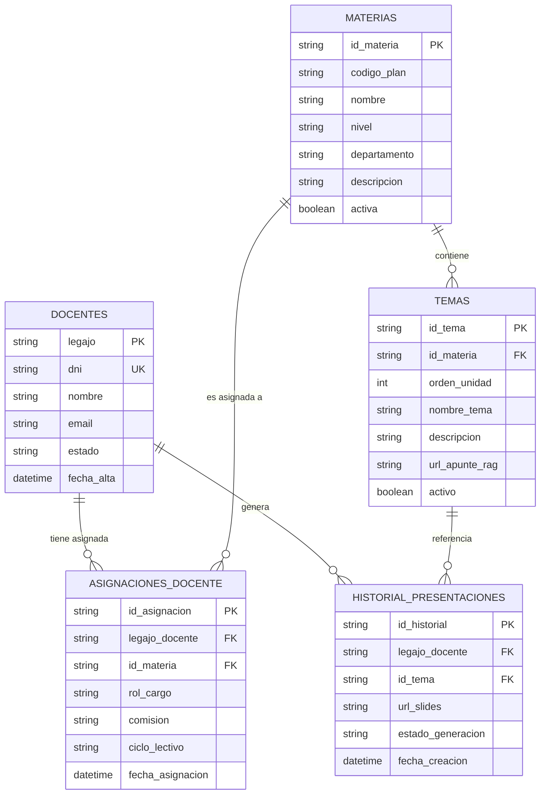

# Memory — UTNContenidos Engineering

> **Última actualización:** 2026-08-07  
> Este archivo es la fuente de verdad técnica del proyecto. Solo se agregan entradas, nunca se sobreescriben las anteriores.

---

## 🔴 Correcciones Confirmadas por el Usuario

| Fecha | Corrección |
|-------|------------|
| 2026-08-07 | **`gemini-3.1-flash-lite` ES un modelo válido** de la Gemini API para API Key. El análisis inicial lo marcó como incorrecto — estaba equivocado. El modelo está bien configurado en `api/gemini.js`. |
| 2026-08-07 | **El login tarda 12 segundos reales** en producción. Confirmado por el usuario. Causa raíz auditada en `app.js`. |

---

## 🏛️ Decisiones de Arquitectura Permanentes

### GAS es irremplazable a costo $0 para Google Workspace
**Decisión:** Google Apps Script se mantiene como backend para:
- `exportarAGoogleSlides()` — `SlidesApp.create()` no tiene equivalente gratuito
- `obtenerContextoTema()` — `DocumentApp.openById()` para leer apuntes en Docs
- `obtenerHistorialDocente()` — historial en Sheets

**Razón:** Ningún servicio a costo $0 tiene acceso nativo a Google Slides/Docs/Drive como GAS. Firebase y Supabase no pueden replicar esto.

**Lo que SÍ se puede migrar de GAS:** Autenticación (`validarDocente`) y base de datos de usuarios/materias (Google Sheets → Supabase PostgreSQL).

### Costo total del proyecto: $0 absoluto
**Restricción innegociable.** Toda propuesta debe respetar:
- ✅ Google Apps Script (gratuito)
- ✅ Google Workspace (Drive, Sheets, Docs, Slides — cuenta institucional UTN)
- ✅ Vercel Free Tier (frontend + serverless functions)
- ✅ Gemini API — Free Tier / gemini-3.1-flash-lite (API Key de Google AI Studio)
- ✅ Supabase Free Tier (500MB DB, 50k req/mes) — para migración futura
- ❌ AWS, GCP de pago, Firebase de pago, cualquier servicio con suscripción

### Público objetivo: docentes de 50+ años, UTN FRD
**Restricción de UX innegociable:**
- Letra grande, alto contraste, botones evidentes
- Máximo 2 clics para llegar a "Preparar Clase"
- Feedback visual inmediato en cada acción (loaders, toasts, animaciones)
- Lenguaje simple, en español argentino (vos)
- La plataforma debe ser autosuficiente — sin necesidad de manual

---

## 🐛 Diagnóstico Técnico Confirmado

### Login de 12 segundos — Causa raíz en `app.js`

**Tres culpables en `validarDocente()` (app.js líneas 39–80):**

1. **Cold Start de GAS (~3–6s):**  
   GAS duerme si no recibe requests. El primer login del día activa el cold start.  
   _Solución:_ Trigger de warmup cada 4 minutos (15 min de trabajo, costo $0).

2. **3× `getDataRange().getValues()` en secuencia (~3–6s total):**  
   ```
   sheetDocentes.getDataRange()  → ~1-2s (API call bloqueante a Sheets)
   sheetMaterias.getDataRange()  → ~1-2s
   sheetTemario.getDataRange()   → ~1-2s
   ```
   _Solución:_ `CacheService.getScriptCache()` para cachear el dashboard completo por legajo (TTL: 1 hora).

3. **Join O(n²) en `obtenerMateriasYTemas()` (app.js líneas 101–142):**  
   Loop de Materias × loop de Temario en memoria. Escala mal con 100+ docentes.  
   _Solución futura:_ Migrar a Supabase PostgreSQL con query JOIN indexado.

### Token de sesión — Estado actual CORRECTO
El token usa `Utilities.getUuid()` (UUID v4) guardado en `CacheService` con TTL de 2 horas. Esto **es correcto y seguro** para el contexto actual. No requiere HMAC — el UUID v4 tiene 122 bits de entropía, inforgeable en la práctica.

### RAG sin caché — Confirmado como problema
`obtenerContextoTema()` re-lee el Google Doc completo en cada generación. Con `CacheService` (TTL 6h), el segundo request al mismo Doc baja de 3–5s a ~100ms.

---

## 📁 Mapa de Archivos del Proyecto

| Archivo | Rol | Notas |
|---------|-----|-------|
| `index.html` | SPA — Estructura HTML completa | 4 vistas: login, dashboard, generator, historial |
| `script.js` | SPA Router + lógica frontend | 743 líneas. Fetch a GAS y a Vercel. |
| `style.css` | Estética premium | Glassmorphism, ambient orbs, Inter/Outfit fonts |
| `api/gemini.js` | Vercel Serverless — Proxy Gemini | 132 líneas. Protege la API key. Modelo: gemini-3.1-flash-lite ✅ |
| `app.js` | GAS Backend — 441 líneas | Auth, RAG, Slides, Historial. Desplegado como Web App. |
| `vercel.json` | Config deploy Vercel | Bug pendiente: Cache-Control `immutable` sin hash de assets |
| `UTNContenidos.md` | System Instructions del Escuadrón | Define roles, principios, flujo funcional |
| `plan23-06.md` | Plan de implementación v3.0 | Rediseño premium + optimización prompt Gemini (en curso) |
| `memory.md` | Este archivo | Fuente de verdad técnica. Solo append. |

### Esquema Relacional Normalizado (DLR / 3NF - Fase 2)



| Hoja / Tabla | Columnas |
|---|---|
| `Docentes` | A: Legajo · B: DNI · C: Nombre · D: Email · E: Estado · F: Fecha_Alta |
| `Materias` | A: ID_Materia · B: Codigo_Plan · C: Nombre · D: Nivel · E: Departamento · F: Descripcion · G: Activa |
| `Asignaciones_Docente` | A: ID_Asignacion · B: Legajo_Docente · C: ID_Materia · D: Rol_Cargo · E: Comision · F: Ciclo_Lectivo · G: Fecha_Asignacion |
| `Temas` | A: ID_Tema · B: ID_Materia · C: Orden_Unidad · D: Nombre_Tema · E: Descripcion · F: Link_Teoria · G: Activo |
| `Historial_Presentaciones` | A: ID_Historial · B: Legajo_Docente · C: ID_Tema · D: URL_Slides · E: Estado_Generacion · F: Fecha_Creacion |

---

## 📋 Backlog Técnico Priorizado

| Estado | ID | Tarea | Esfuerzo | Sprint |
|--------|----|-------|----------|--------|
| ✅ Completado | T1 | **Warmup Trigger GAS** (función `mantenerCaliente` agregada en `app.js`) | 15 min | S1 |
| ✅ Completado | T2 | **CORS restrictivo** en `api/gemini.js` (dominios autorizados Vercel/Local) | 10 min | S1 |
| ✅ Completado | T3 | **Fix Cache-Control** en `vercel.json` (`max-age=3600, must-revalidate`) | 5 min | S1 |
| ✅ Completado | T4 | **CacheService dashboard** en `validarDocente()` (evita re-lectura bloqueante de Sheets) | 2h | S2 |
| ✅ Completado | T5 | **CacheService RAG** en `obtenerContextoTema()` (lectura instantánea a ~100ms de Google Docs) | 1h | S2 |
| ✅ Completado | T10 | **Reclamar/Gestionar Materias** (Backend `obtenerOfertaAcademica` + `reclamarMaterias`, Modal UI y sincronización de Dashboard) | 2h | S2 |
| ✅ Completado | T6 | **Rediseño de Presentaciones & Prompt de Élite IA v3.0** (7 slides didácticos, notas de orador nativas en Google Slides/PDF y branding UTN) | 2h | S2 |
| 🔲 Pendiente | T7 | **Versionar GAS con clasp** — `gas/app.gs` en el repo | 1h | S3 |
| 🔲 Pendiente | T8 | **Migrar Auth a Supabase** — login ~200ms permanente | 1 semana | S4 |
| 🔲 Pendiente | T9 | **Migrar DB (Sheets) a Supabase PostgreSQL** | 2 semanas | S4 |

---

## 🧠 Log de Conversaciones

| Fecha | Evento |
|-------|--------|
| 2026-08-07 | Primera auditoría completa. Leídos: `index.html`, `script.js`, `style.css`, `api/gemini.js`, `app.js`, `vercel.json`, `UTNContenidos.md`, `plan23-06.md`. |
| 2026-08-07 | Usuario corrigió: `gemini-3.1-flash-lite` es válido. Incorporado. |
| 2026-08-07 | Usuario confirmó: login real tarda 12 segundos. Causa raíz identificada en 3 puntos de `app.js`. |
| 2026-08-07 | Decisión de arquitectura: GAS se mantiene para Google Workspace. Se optimiza con CacheService + warmup. |
| 2026-08-07 | Aplicadas mejoras directas en codebase (T1 a T5): CORS en `api/gemini.js`, Cache-Control en `vercel.json`, y `mantenerCaliente` + `CacheService` (dashboard/RAG) en `app.js`. |
| 2026-08-07 | Aprobado e implementado el Plan Maestro de Reclamación de Materias (T10): Endpoints en `app.js`, UI Modal en `index.html` y script controlador en `script.js`. |
| 2026-08-14 | **Inicio de Fase 2:** Rediseño DLR normalizado en 3NF con tabla de unión `Asignaciones_Docente` y desacople total de temas de cátedra. Guardado en memoria y activado en backend. |
| 2026-08-14 | **Transformación Pedagógica IA (T6):** Prompt de élite universitaria UTN (7 momentos didácticos), notas de orador automáticas en Google Slides (`getNotesPage()`), vista previa enriquecida y PDF descargable con guía docente. |
| 2026-08-14 | **Fix UI & Backend:** Se garantizó que siempre aparezca el botón "Preparar Clase" aunque una materia no tenga temas aún cargados en `Temario` (tema comodín automático). |
| 2026-08-14 | **Arquitectura Híbrida Gemini (Fix HTTP 405):** Se incorporó `generarClaseConGeminiGAS` en `app.js` y fallback transparente en `script.js` para permitir la generación tanto en Vercel como en entornos locales/GAS directo. |
| 2026-08-18 | **Optimización Extrema de Tokens & Motor Visual Slides v3.5:** Implementación de `systemInstruction` + `responseSchema` (Structured Outputs) en `api/gemini.js` y `app.js` (>60% ahorro de tokens y garantía estricta de 7 slides). Rediseño total de `exportarAGoogleSlides` en `app.js` con maquetación de tarjetas (Cards), tipografía `Montserrat`/`Open Sans`, paleta institucional UTN FRD e inserción automática de imágenes HD. |

